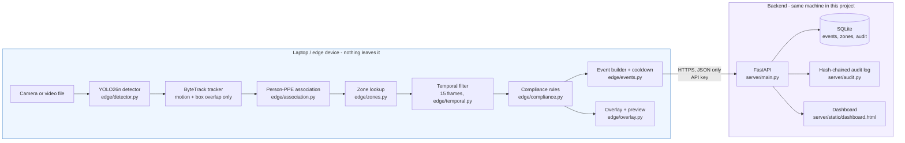

# Architecture and data flow

Two diagrams and the contracts between the parts. GitHub and VS Code render the Mermaid
blocks; if you need images for the report, screenshot the rendered view.

---

## 1. What runs where



**The privacy boundary is the arrow between the two boxes.** Frames never cross it - only
structured events do: timestamp, camera id, anonymous worker id, zone, status, reasons,
confidence.

## 2. One frame, step by step

```mermaid
sequenceDiagram
    participant C as Camera
    participant D as YOLO26n
    participant A as Association
    participant R as Rules (temporal)
    participant S as Server
    participant P as Copilot (rules)
    participant H as Human reviewer

    C->>D: BGR frame (640x480)
    D->>D: one forward pass -> boxes + classes + confidence
    D->>A: person boxes (with track ids) + PPE boxes
    A->>A: head region for helmet/mask, torso for vest<br/>PPE box >= 50% inside -> assigned to that person
    A->>R: Worker objects with their PPE
    R->>R: last 15 frames per worker per item<br/>missing >= 10 -> POTENTIAL_VIOLATION<br/>missing 5-9 -> UNCERTAIN<br/>missing < 5 -> worn
    R->>S: safety event (JSON) only when the state changes, 30 s cooldown
    S->>S: validate, store, append to the hash-chained audit log
    S->>P: verdict -> copilot rules
    P->>S: ONE proposed action from the allow-list, with rule + evidence
    S->>H: dashboard shows the event and the proposal
    H->>S: named person approves or rejects - nothing runs before this
    S->>S: execute (local outbox line / flag) + audit row naming the decider
    Note over C,D: the frame is discarded here; it is never written to disk or uploaded
    Note over P,H: the machine proposes, the human disposes - there is no auto-approve path
```

## 3. Why the parts are separate

| Part | Responsibility | Why it is its own module |
|---|---|---|
| `edge/detector.py` | *What is visible* - a statistical model | The only component that can be "wrong" in a fuzzy way. Isolating it keeps that uncertainty in one place |
| `edge/association.py` | *Whose PPE is whose* - geometry | Pure functions on boxes: unit-testable with hand-written numbers, no GPU, no camera |
| `edge/temporal.py` | *Is this stable or a flicker?* | One bad frame should never raise a violation |
| `edge/compliance.py` | *Is this a problem?* - deterministic rules | A safety decision must be explainable and auditable. Rules live in `configs/policies.yaml`, so site policy changes without code changes |
| `edge/detect.py` | Single-frame demo path | Simple enough to explain in a viva; shares association and status logic with the full pipeline so the two cannot disagree |
| `server/routes/predict.py` | Same pipeline over HTTP | Lets the dashboard and other tools reuse the edge logic without duplicating it |
| `server/audit.py` | Tamper-evident record | Each entry hashes the previous one, so silent edits are detectable |
| `shared/copilot.py` | *What should be done about it* - a five-item allow-list and five rules | Keeping the system's entire vocabulary of actions in one small file means extending it is a visible policy decision, not a code detail |
| `shared/privacy.py` | *What may be stored* - face-band masking, fail-closed | The one place that can write an image, so the privacy rule has a single choke point |

**The model never decides compliance, the rules never look at pixels, and neither one ever
acts.** Three separations, in that order, are the core design claim of the project.

## 4. Contracts

* **Class order** - `person, helmet, vest, mask` (0-3). Fixed in `datasets/ppe4/data.yaml`,
  baked into the checkpoint, mapped by `edge/detector.py: NAME_ALIASES`, and locked by a
  unit test. A silent reordering would invalidate every prediction.
* **Event schema** - `shared/schemas.py` (`CONTRACT_VERSION`), shared by edge and server so
  the two halves cannot drift.
* **Policy** - `configs/policies.yaml`: required PPE per zone type, detection thresholds,
  temporal window, cooldown. `configs/zones.yaml`: zone polygons in pixel coordinates.
* **Prediction API** - `POST /api/v1/predict` with an image; returns per-person status,
  missing items, confidences, counts, and `image_stored: false`.
* **Copilot allow-list** - `shared/copilot.ACTIONS`. Every path that stores or executes goes
  through `check_action()`, and the list is published at `/api/v1/copilot/catalog`. Adding an
  entry is a governance change and should be reviewed as one.

## 5. Failure behaviour

| If this fails | What happens |
|---|---|
| Model file missing | `edge.detect` exits with "Model not found. Train it first"; the API returns **503** with the same sentence. The server still starts |
| Camera busy or absent | "Could not open webcam", with a hint to close other apps or try `--source 1` |
| Network to the server down | The edge loop keeps detecting and writes events to `data/edge_events.jsonl` for later sync - offline operation is the normal case, not an error |
| Fewer than 15 frames seen for a worker | Status is `UNCERTAIN (INSUFFICIENT_EVIDENCE)`, never a violation |
| Detector misses PPE | A violation is not raised. This is the known dangerous direction - recall 0.71, see `docs/model_card.md` |
